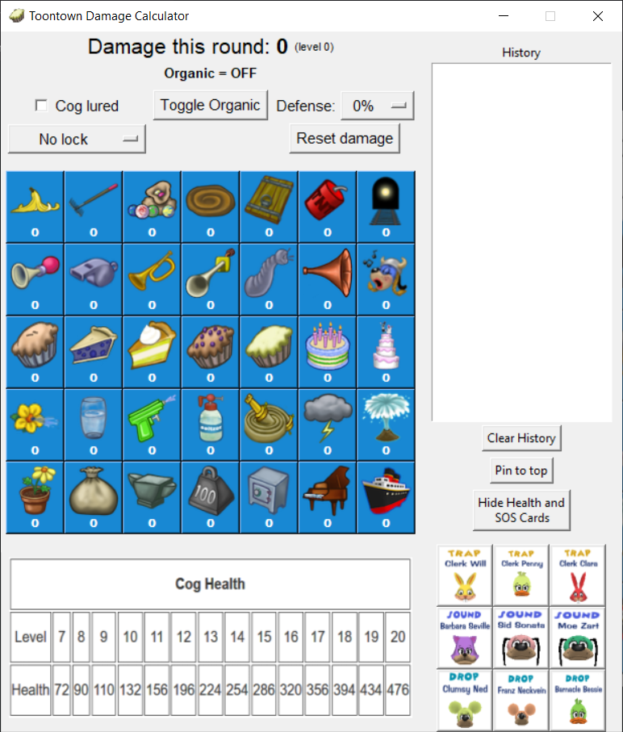

# TT-Damage-Calculator

 [](https://github.com/Vhou-Atroph/TT-Damage-Calculator/releases/latest) 

 Gag damage calculator for [Toontown Rewritten](https://toontownrewritten.com/).



## Building

### Prerequisites

1. The Python 3 Programming Language. Install from <https://www.python.org/downloads/>.
2. The Rust Programming Language. Install by following the instructions at <https://www.rust-lang.org/learn/get-started>.
3. Maturin. Install by following the instructions at <https://www.maturin.rs/installation.html>.

### Creating the wheel

Once the prerequisites are installed, clone the repository with git:

```shell
git clone https://github.com/Vhou-Atroph/TT-Damage-Calculator
```

With the repository cloned, navigate to the directory and build the project with maturin:

```shell
maturin build -i python
```

This should have created the "target" file in the project's main directory. Navigate to `target/wheels` and install the created file with pip:

```shell
pip install [file]
```

### Running

After installing the wheel, you can run it from your favorite command terminal with:

```shell
python -m tt_damage_calculator
```

### What if I don't want to build the program?

#### GitHub

For some versions of the calculator, I will compile it completely and release a standalone executable for users who either do not want to or are unable to compile the dependencies themselves. You can find the latest release at <https://github.com/Vhou-Atroph/TT-Damage-Calculator/releases/latest>.

GitHub executable releases target Windows users. Linux users must use Pypi to install this program.

#### Pypi

Alternatively, you can install the package using Pypi:

```shell
pip install [ill put a package name here when im sure to have it reserved]
```

After installing the package, you can run it via the terminal:

```shell
python -m tt_damage_calculator
```

## Usage

### Gag Selection

Click any gag on the grid to add it to the calculation.

### Statuses/Modifiers

There are three buttons available above the gag selection that allow for certain functionalities: if a cog being lured that round, whether a gag is organic or not, and the ability to reset the current calculation. Other cog modifiers such as defense and v2 level can be found in the menu bar under "Calculations."

### Other Features

There are two buttons in the bottom right corner of the program.  
'Clear History' will clear all text in the History panel, which logs previous calculations.  
'Show Health and SOS Cards' brings up a grid of all cog health values from Level 7 to Level 20, as well as the major SOS cards for Trap, Sound, and Drop. This can be toggled by clicking on it a second time.

The program has various keybinds to expedite calculation:
| Keybind     | Description         |
| ----------- | ------------------- |
| shift       | Toggle Organic      |
| ctrl+l      | Toggle Lure         |
| ctrl+r      | Finish Calculation  |
| ctrl+d      | Cycle  Defense      |
| ctrl+v      | Cycle v2 levels     |
| ctrl+x      | Lock/Unlock statuses|
| alt+up      | Toggle Pinned Window|

## License

Code in TT-Damage-Calculator is licensed under the [GNU General Public License v3.0](/LICENSE).

## Final Notes

[](https://ko-fi.com/I2I65IWZG)
