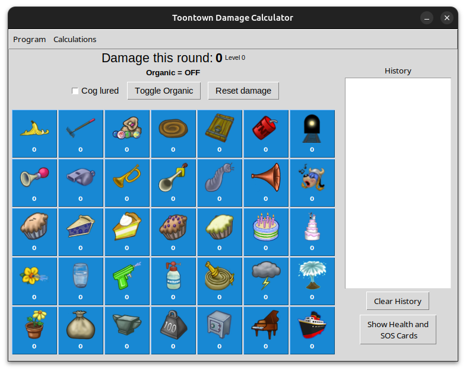

# 

 [](https://github.com/Vhou-Atroph/TT-Damage-Calculator/releases/latest)  

 Gag damage calculator for [Toontown Rewritten](https://toontownrewritten.com/).



## Downloading

### Windows and MacOS Executable

The executable version of the calculator requires the least setup, and is highly portable with the limitation that it only easily works on devices running the required operating system. You can find a download for the latest version of the executable either at <https://github.com/Vhou-Atroph/TT-Damage-Calculator/releases/latest/> on GitHub, or at <https://vhou.gloop.group/projects/gagcalc> near the bottom of the page.

The downloaded archive should contain the executable, a [LICENSE](LICENSE) file, and the assets folder. Once you extract the zip file to your preferred directory, the calculator should run normally!

`Note: The MacOS executable version of the gag calculator may not work properly, as it is untested due to a lack of access to the relevant hardware.`

### Python Package

The Python Package version of the calculator is the most accessible across operating systems that are not Windows or MacOS. Downloading the Toontown Damage Calculator as a Python package will require [downloading the Python programming language](https://www.python.org/downloads/). Once this is done, you can open your command terminal and run the following command:

```shell
pip install tt_damage_calculator
```

This will install the calculator as a Python package to your computer. You can run the calculator from the command line by inputting the following into your terminal:

```shell
python -m tt_damage_calculator
```

If you are unable to download the calculator via pip for your system, you will need to build it yourself by following the [Building: Wheels (All Platforms)](https://github.com/Vhou-Atroph/TT-Damage-Calculator/wiki/Building:-Wheels-(All-Platforms)) guide on the wiki.

#### On Linux and MacOS

On certain Linux distributions and MacOS, your installation of Python may not come with tkinter, which will greatly restrict your ability to run the program (you won't be able to). You can fix this with one of the below commands:

```shell
sudo apt-get python3-tk # Debian based distributions
sudo dnf install python3-tkinter # Fedora based distributions
sudo yum install python3-tkinter # RHEL based distributions
sudo pacman -S tk # Arch based distributions
sudo zypper in python-tk # openSUSE based distributions
sudo xbps-install python3-tkinter # Void based distributions
brew install python-tk # MacOS
```

## Building

There are guides on the [repository's wiki](https://github.com/Vhou-Atroph/TT-Damage-Calculator/wiki) for building the calculator:

- [Building: Wheels (All Platforms)](https://github.com/Vhou-Atroph/TT-Damage-Calculator/wiki/Building:-Wheels-(All-Platforms))
- [Building: MacOS Executable](https://github.com/Vhou-Atroph/TT-Damage-Calculator/wiki/Building:-MacOS-Executable)
- [Building: Windows Executable](https://github.com/Vhou-Atroph/TT-Damage-Calculator/wiki/Building:-Windows-Executable)

## Usage

The [TT-Damage-Calculator wiki](https://github.com/Vhou-Atroph/TT-Damage-Calculator/wiki) has several guides on the usage of the program:

- [Usage: Defense](https://github.com/Vhou-Atroph/TT-Damage-Calculator/wiki/Usage:-Defense)
- [Usage: Gags](https://github.com/Vhou-Atroph/TT-Damage-Calculator/wiki/Usage:-Gags)
- [Usage: History](https://github.com/Vhou-Atroph/TT-Damage-Calculator/wiki/Usage:-History)
- [Usage: Keybinds](https://github.com/Vhou-Atroph/TT-Damage-Calculator/wiki/Usage:-Keybinds)
- [Usage: Lock Status](https://github.com/Vhou-Atroph/TT-Damage-Calculator/wiki/Usage:-Lock-Status)
- [Usage: Lure](https://github.com/Vhou-Atroph/TT-Damage-Calculator/wiki/Usage:-Lure)

### Gag Selection

Click any gag on the grid to add it to the calculation.

### Statuses/Modifiers

There are three buttons available above the gag selection that allow for certain functionalities: if a cog being lured that round, whether a gag is organic or not, and the ability to reset the current calculation. Other cog modifiers such as defense can be found in the menu bar under "Calculations."

### Other Features

There are two buttons in the bottom right corner of the program.  
'Clear History' will clear all text in the History panel, which logs previous calculations.  
'Show Health and SOS Cards' brings up a grid of all cog health values from Level 7 to Level 20, as well as the major SOS cards for Trap, Sound, and Drop. This can be toggled by clicking on it a second time.

The program has various keybinds to expedite calculation:

| Keybind     | Description             |
| ----------- | ----------------------- |
| shift       | Toggle Organic          |
| ctrl+l      | Toggle Lure             |
| ctrl+r      | Reset  Calculation      |
| ctrl+d      | Cycle  Defense          |
| alt+d       | Cycle  Negative Defense |
| ctrl+x      | Lock/Unlock statuses    |
| alt+up      | Toggle Pinned Window    |

It is possible to change these keybinds. There is a guide on the wiki to doing so on the [Usage: Keybinds](https://github.com/Vhou-Atroph/TT-Damage-Calculator/wiki/Usage:-Keybinds#editing-a-keybind) page.

## License

Code in TT-Damage-Calculator is licensed under the [GNU General Public License v3.0](/LICENSE).

## Final Notes

[](https://ko-fi.com/I2I65IWZG)
